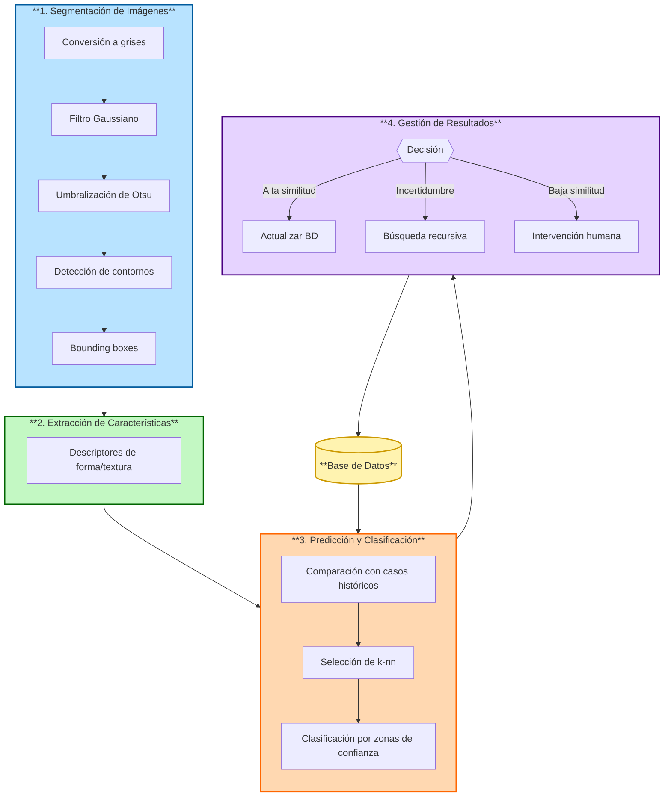
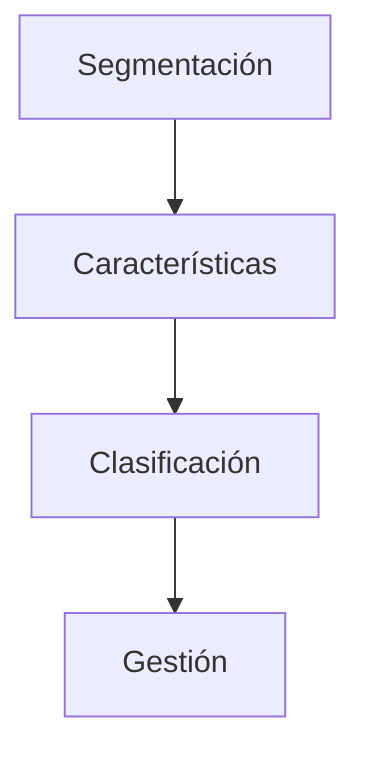

# Flujo del pipeline de trabajo con CBRT

# Pipeline Vertical como solución al problema

# Algoritmos alternativos a cada bloque

### **1. Segmentación de Imágenes**  
**Algoritmos actuales**:  
- Umbralización de Otsu, Detección de contornos (OpenCV)

**Alternativas/Complementos**:  

| Algoritmo | Uso | Ventajas | Desventajas |
|-----------|-----|----------|-------------|
| **CNN (U-Net/Mask R-CNN)** | Segmentación semántica/instancia | Alta precisión con datos etiquetados | Requiere gran cantidad de datos |
| **K-Means** | Clustering de píxeles | Simple para pre-segmentación | Sensible a inicialización |
| **Watershed** | Segmentación basada en marcadores | Bueno para objetos superpuestos | Requiere parámetros ajustables |
| **Superpixels (SLIC)** | División en regiones homogéneas | Reduce complejidad computacional | Menos preciso en bordes irregulares |
| **GrabCut** | Segmentación interactiva | Combina modelos gráficos y user-input | Requiere intervención humana |

---

### **2. Extracción de Características**  
**Algoritmos actuales**:  
- GLCM, LBP, Momentos de Hu, Histogramas

**Alternativas/Complementos**:  

| Algoritmo | Uso | Ventajas | Desventajas |
|-----------|-----|----------|-------------|
| **CNN (ResNet/VGG)** | Extracción automática de _features_ | Captura patrones jerárquicos | Requiere fine-tuning |
| **Autoencoder** | Reducción dimensionalidad | Aprendizaje no supervisado | Pérdida de interpretabilidad |
| **SIFT/SURF** | Descriptores locales invariantes | Robustez a transformaciones | Computacionalmente costoso |
| **HOG** | Detección de bordes orientados | Efectivo para formas | Sensible a iluminación |
| **Transformers (ViT)** | Captura contexto global | Bueno para relaciones espaciales | Alto costo computacional |

---

### **3. Similitud y Clasificación**  
**Algoritmos actuales**:  
- k-NN con métricas híbridas

**Alternativas/Complementos**:  

| Algoritmo | Uso | Ventajas | Desventajas |
|-----------|-----|----------|-------------|
| **SVM** | Clasificación lineal/no-lineal | Efectivo en espacios de alta dimensión | Sensible a parámetros de kernel |
| **Random Forest** | Clasificación ensemble | Reduce sobreajuste | Menos interpretable |
| **XGBoost/LightGBM** | Clasificación con boosting | Alta precisión en tabular data | Requiere ajuste de hiperparámetros |
| **Siamese Networks** | Aprendizaje métrico | Robustez a variaciones intra-clase | Necesita pares de entrenamiento |
| **DBSCAN** | Clustering para agrupamiento | Detecta outliers automáticamente | Sensible a parámetros ε y min_samples |

---

### **4. Gestión de Conocimiento**  
**Algoritmos actuales**:  
- CBR (Case-Based Reasoning)

**Alternativas/Complementos**:  

| Algoritmo | Uso | Ventajas | Desventajas |
|-----------|-----|----------|-------------|
| **Autoencoder + K-Means** | Clustering de casos | Reduce redundancia en la BD | Pérdida de detalles finos |
| **Graph Neural Networks** | Representación relacional | Modela conexiones entre casos | Complejidad de implementación |
| **Active Learning + SVM** | Muestreo interactivo | Optimiza anotación humana | Depende del oráculo humano |
| **Reinforcement Learning** | Actualización dinámica de BD | Aprendizaje adaptativo continuo | Costoso en recursos |
| **Ontologías** | Organización semántica | Facilita razonamiento lógico | Requiere diseño experto |

# Combinaciones Propuestas  
Cada combinación representa una configuración específica de algoritmos en los 4 bloques del pipeline:

| #   | Segmentación     | Extracción de Características | Clasificación/Similitud | Gestión de Conocimiento      |
| --- | ---------------- | ----------------------------- | ----------------------- | ---------------------------- |
| 1   | Otsu + Contornos | GLCM + Hu Moments             | k-NN ponderado          | CBR + Active Learning        |
| 2   | U-Net (CNN)      | Autoencoder + Estadísticas    | SVM (RBF Kernel)        | CBR + K-Means clustering     |
| 4   | Mask R-CNN       | SIFT + LBP                    | Random Forest           | Ontologías + Active Learning |